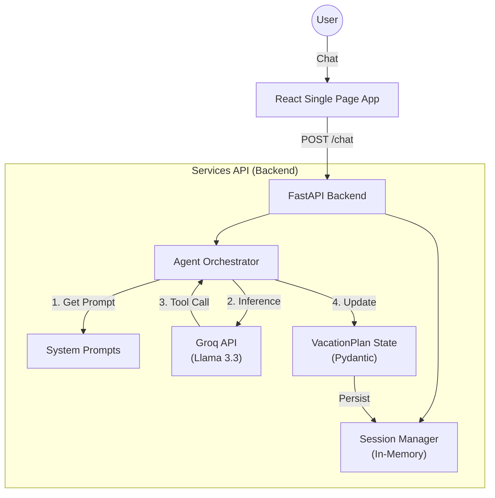
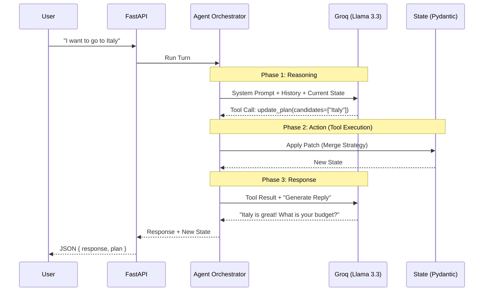

# Sprint 1 Completion: Architecture & implementation

## **Overview**
The **Agentic Travel Planner** is a "headless" agent decision support system wrapped in a minimal React UI. It uses a **State Machine** pattern to help users narrow down vacation choices through structured reasoning, rather than just generating chat text.

---

## **1. High-Level Architecture**

The system follows a standard **Client-Server** model, simulating a production AI microservice architecture.

> **Note on Diagrams**: The diagrams below are written in **Mermaid.js**. GitHub and VS Code (with the Markdown Preview Mermaid Support extension) will render them automatically. If you see code blocks, please use a compatible viewer or read the text descriptions below.



### **Architecture Explained**
1.  **User -> Frontend**: The user interacts with a React web app.
2.  **Frontend -> Backend**: Messages are sent via a simple HTTP POST request to the Python backend.
3.  **Backend Services**: 
    *   **Session Manager**: Retains the conversation history and current plan (in memory for now).
    *   **Agent Orchestrator**: The "brain" that coordinates the logic.
    *   **LLM (Groq)**: The intelligence engine that generates text and decisions.
    *   **Pydantic State**: The strict data structure that holds the vacation plan.

---

## **2. The Agent Loop (State Machine)**

Unlike a basic chatbot, this agent follows a strict **Think-Act-Observe** loop efficiently compressed into a single turn for Sprint 1.



### **The Loop Step-by-Step**
1.  **Input**: User sends a message ("I want to go to Italy").
2.  **Reasoning (Phase 1)**: The Agent Orchestrator sends the user message + current state to the LLM.
3.  **Tool Call**: The LLM analyzes the input and decides it needs to update the plan. It calls `update_plan(candidates=["Italy"])`.
4.  **Action (Phase 2)**: The Orchestrator pauses, executes the tool update locally, and modifies the Pydantic State object.
5.  **Response (Phase 3)**: The Orchestrator feeds the *result* of the tool (Success) back to the LLM and asks for a final response.
6.  **Output**: The LLM generates a natural language reply ("Italy is great!"), which is returned to the user along with the new State.

---

## **3. Component Breakdown**

### **Frontend (`apps/web`)**
A lightweight interface built with **React**, **Vite**, and **Tailwind CSS**.
- **`ChatInterface`**: Handles the conversation stream. Updates optimistically.
- **`DebugPanel`**: A key "Agentic" feature. It visualizes the **internal state** (`VacationPlan`) of the agent in real-time, proving that the agent is "thinking" and maintaining context, not just hallucinating text.
- **`useAgent` Hook**: Manages the API lifecycle and synchronizes the local state with the backend response.

### **Backend (`services/api`)**
A **FastAPI** service that acts as the brain.
- **`main.py`**: Entry point. exposes `POST /chat`. Manages CORS and request validation.
- **`agent/orchestrator.py`**: The "Heart" of the system.
    - Constructs the context window.
    - Calls the LLM (Groq).
    - **Executes Tools**: If the LLM decides to `update_plan`, the Orchestrator executes this logic locally and then feeds the result back to the LLM for a final natural language response.
- **`agent/models.py`**: "The Truth". Defines the `VacationPlan` schema using **Pydantic**. This ensures strict typing for the agent's memory.
- **`agent/session.py`**: A simple in-memory store mapping `session_id` -> `History + Plan`. (In a real app, this would be Redis/Postgres).

---

## **4. How this is done for Real-World AI Products**

This Sprint 1 implementation simulates a real architecture but simplifies infrastructure for ease of learning. Here is how this project differs from a Series A/B startup's production code:

| Component | This Project (Sprint 1) | Real-World Production (2026) |
| :--- | :--- | :--- |
| **Orchestration** | Simple Python `class` loop (Custom) | **LangGraph** or **Burr**. Explicit graphs allow for complex loops (e.g., retries, human-in-the-loop, parallel branches). |
| **State Persistence** | In-Memory Dictionary (Lost on restart) | **Postgres** (Relational) or **Redis** (Fast access). State is durable and versioned. |
| **Observability** | `print()` statements to console | **LangSmith**, **Arize Phoenix**, or **Helicone**. Every token, latency ms, and tool call is traced and visualizable. |
| **Schema/Validation** | Pydantic (Standard) | **Pydantic** (Standard). We are actually using the industry standard here! |
| **LLM Gateway** | Direct Client (`Groq(...)`) | **LiteLLM** or **Portkey**. Gateways handle fallback (e.g., if Groq is down -> call OpenAI), cost tracking, and caching. |
| **Testing (Evals)** | Manual "Eye-balling" | **Pytest** + **LLM-as-a-Judge**. Automated scripts run 100 interaction scenarios and grade the agent's success rate. |
| **Frontend State** | Polling / Request-Response | **Server-Sent Events (SSE)** or **WebSockets**. Real agent UIs stream tokens and status updates (e.g., "Thinking...", "Searching...") in real-time. |

### **Why we chose this approach for Sprint 1**
We avoided frameworks (LangChain/LangGraph) and databases to ensure you understand **first principles**. By writing the raw loop and state management yourself, you verify that "Agents" are just loops that modify variables, not magic. Future sprints can adopt frameworks once the core intuition is solid.

## **Directory Structure Map**

```text
vacation-planner/
├── apps/
│   └── web/                  # Frontend
│       ├── src/
│       │   ├── components/   # ChatInterface, DebugPanel
│       │   ├── hooks/        # useAgent (API logic)
│       │   └── types.ts      # Shared interfaces
│       └── tailwind.config.js
│
├── services/
│   └── api/                  # Backend
│       ├── main.py           # FastAPI App
│       ├── core/             # Config, LLM Client
│       └── agent/
│           ├── orchestrator.py # The Agent Loop
│           ├── models.py       # Pydantic Schemas (The "Brain")
│           ├── prompt.py       # System Prompts
│           └── session.py      # In-memory DB
│
└── docs/                     # Documentation
    └── project-description.md # This file
```