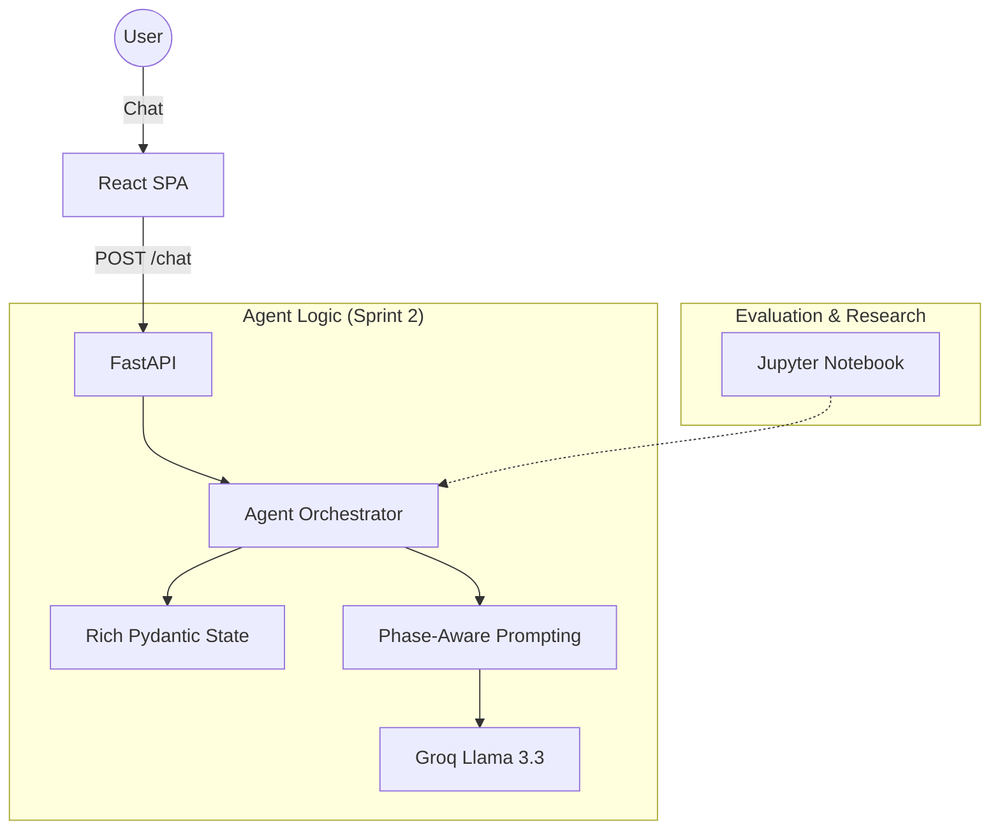

# Sprint 2 Completion: The Adaptive Agent & Evaluation Workbench

## **1. Overview**
Sprint 2 focused on transitioning the "headless" agent from a reactive chatbot into a structured **Travel Consultant**. The primary goal was to implement **Adaptive Discovery**—ensuring the agent identifies what it doesn't know and guides the user through a decision funnel rather than just asking a list of pre-set questions.

Key focus areas:
- **Intelligent Adaptation**: Moving from a flat state to a "Rich State" that tracks the user's mental model.
- **Engineering Rigor**: Introducing a testing workbench to move away from vibe-based evaluations.
- **UI Stability**: Fixing layout issues that blocked effective user testing.

---

## **2. Architecture & Tech Stack**
The core architecture remains a **Client-Server (React + FastAPI)** model, but the internal "Brain" (Agent Layer) has been refactored for better orchestration.



### **Component Updates**
- **Rich State (Backend)**: Replaced the flat `VacationPlan` with a nested structure containing `TripShape` and `MentalModel`.
- **Phase-Aware Prompting**: The system prompt now dynamically adjusts based on the internal `phase` of the plan.
- **Sticky Debug Panel (Frontend)**: The UI now keeps the agent's internal state visible at all times to help with debugging and alignment.

---

## **3. The Agent Loop Evolution**
The agent loop was upgraded from a "record facts" loop to an **"Identify Gaps"** loop.

### **Sprint 1 Loop (Chatbot)**
1. User Message -> LLM.
2. LLM updates flat JSON dict.
3. LLM replies.

### **Sprint 2 Loop (Consultant)**
1. **Analyze**: LLM reads history and the **Rich State** (knowns vs. unknowns).
2. **Gap Assessment**: The agent identifies the "Critical Unknowns" (e.g., if we have a destination but not the "Why", we can't recommend a budget).
3. **Adaptive Act**: The agent uses `update_plan` to refine the `MentalModel` and `TripShape`.
4. **Listen & Guide**: The agent prioritizes one "Unknown" at a time in a conversational tone, or suggests destinations to help close gaps.

---

## **4. Front-End Changes**
Improvements focused on **UI Stability** and **Transparency**.
- **Layout Constrain**: Fixed a bug where the message container would widen infinitely, breaking the layout.
- **Sticky Side-Panel**: The `DebugPanel` (Agent State) is now sticky and overflows independently, allowing the user to watch the state evolve without scrolling up.
- **Natural Language Primer**: Updated the input placeholder to: *"What are you thinking about for your next vacation?"* to encourage more descriptive user inputs.

---

## **5. Product Impact & Rationale**
**Why this way?**
Real travel planning isn't a form-filling exercise; it's a discovery process. 
- **The "Why" Matters**: By capturing `vacation_purpose` (the reason for travel), the agent can pivot its suggestions (e.g., "anniversary" vs. "budget escape").
- **Reducing Cognitive Load**: By tracking `unknowns`, the agent avoids repeating questions and ensures the conversation always moves toward a "Bookable State".

**Impact**: The tool feels less like a bot and more like a partner that "remembers" and "understands" the context of the trip.

---

## **6. How this is done for Real-World AI Products**
- **Adaptive Discovery**: Companies like **Perplexity** or **Typeform (AI)** use similar loops to predict what information is missing to provide the most value.
- **Golden Scenarios**: In production, the "Workbench" we built would be part of a CI/CD pipeline using tools like **Promptfoo**. Every code push would run the agent against 50+ traveler scenarios to ensure no quality regressions.
- **State Partitioning**: By separating the `TripShape` (logistics) from the `MentalModel` (sentiments/gaps), we mirror how production RAG systems handle context vs. metadata.

---

## **7. Learning Notebook Changes**
- **`learning-notebooks/3_agent_loop.ipynb`**: Remains as a foundational tutorial for the basic loop.
- **[NEW] `learning-notebooks/4_agent_evals.ipynb`**: Introduced as the **Engineering Workbench**. It allows us to:
    - Run the agent against different **Personas** (e.g., "The Vague Dreamer" vs. "The Budget Backpacker").
    - A/B test system prompt variations side-by-side.
    - Measure state extraction accuracy programmatically.

---

## **8. Documentation & Configuration Changes**
- **`README.md`**: Fully restored to a project-level overview. Corrected run instructions to be clear and restored `uv` setup steps.
- **`models.py`**: Completely refactored to support nested Pydantic models and deep-patching.
- **`prompt.py`**: Refactored into a `Phase-Aware` multi-prompt system.
- **`orchestrator.py`**: Added a `deep_merge` utility to handle partial updates to nested JSON states correctly.

---

## **9. Updated Directory Map**

```text
vacation-planner/
├── apps/
│   └── web/                  # Frontend (React)
│       └── src/
│           ├── components/   # ChatInterface (Fixed), DebugPanel (Sticky)
│           └── ...
├── services/
│   └── api/                  # Backend (FastAPI)
│       ├── main.py           # API Endpoints
│       └── agent/
│           ├── orchestrator.py # Nested Tool Handler
│           ├── models.py       # Rich State Schema
│           └── prompt.py       # Phase-Aware Prompts
├── learning-notebooks/
│   ├── 3_agent_loop.ipynb    # Loop Tutorial
│   └── 4_agent_evals.ipynb   # [NEW] Testing Workbench
├── docs/
│   ├── project-brief/        # Grounding Docs
│   ├── sprint-1-result.md    # V1 History
│   └── sprint-2-result.md    # [NEW] This File
└── README.md                 # Updated run instructions
```
