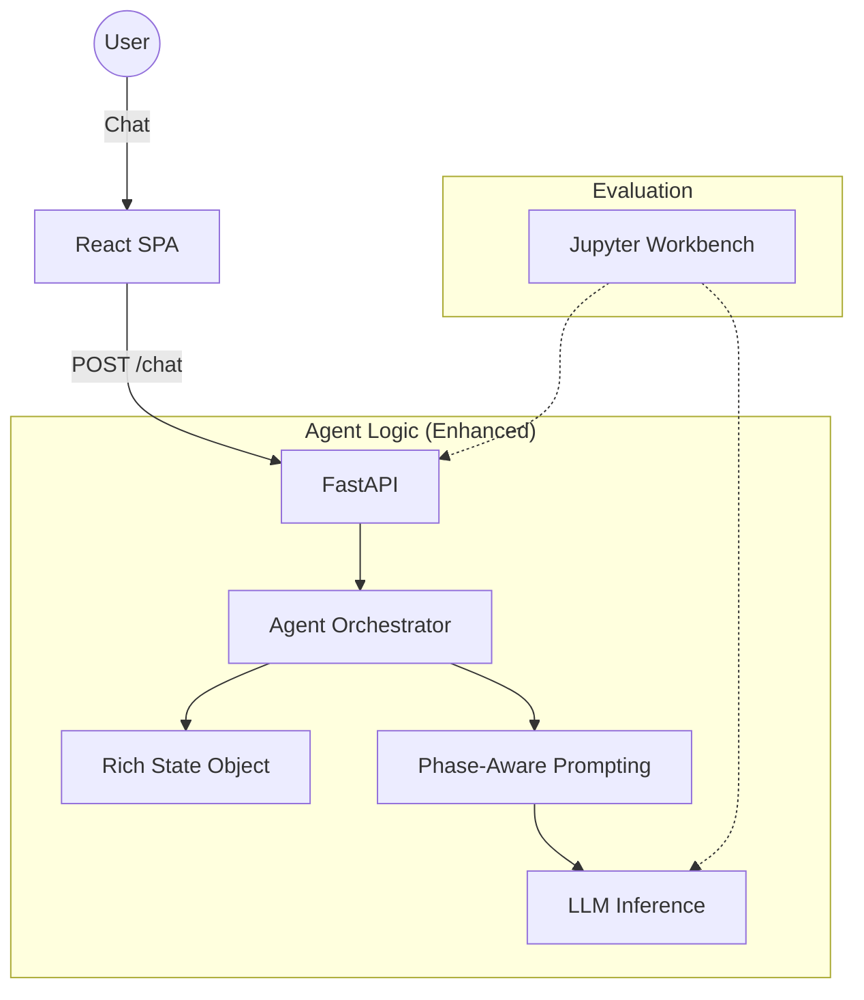

# Sprint 2 Implementation Spec: The Adaptive Agent & Evaluation Workbench

## **1. Executive Summary: From Chatbot to Decision Helper**
Sprint 2 transitions the "headless" agent from a simple reactive chatbot into a structured **travel consultant**. We are focusing on **Intelligent Adaptation**—ensuring the agent identifies what it doesn't know and guides the user through an "Adaptive Funnel" rather than just asking a list of questions.

We are also introducing **Engineering Rigor** via a Testing Workbench to move away from "vibe-based" evaluations toward measurable alignment.

---

## **2. Scope & Non-Goals**

### **Scope**
- **UI Stabilisation**: Fix layout container issues (widening and sticky behavior) to enable better user-testing.
- **State Schema Evolution**: Refactor `VacationPlan` to capture "Trip Shape", "Context/Sentiment", and "Mental Model (Knowns/Unknowns)".
- **Adaptive Prompting**: Implement a phase-aware system prompt (Context -> Explore -> Refine -> Finalize).
- **The Workbench**: Create `learning-notebooks/4_agent_evals.ipynb` for A/B testing and scenario simulation.

### **Non-Goals**
- **External Data APIs**: No real-time flight/hotel data yet (Sprint 3).
- **Production UI**: No rich cards, maps, or sophisticated styling yet (Sprint 4).
- **Authentication/Persistance**: Remaining in-memory for single-session use.

---

## **3. Proposed Architecture (Sprint 2)**

The core architecture remains **Client-Server (FastAPI + React)**, but the "Brain" (Agent Layer) becomes more modular.



### **Changes from Sprint 1**
- **Phase-Aware Prompting**: The system prompt is no longer static; it adjusts based on the internal `phase` of the `VacationPlan`.
- **Rich State**: The state object now includes a `mental_model` section to track "What we know vs. what we need to find out".

---

## **4. Agent Loop Design: The Adaptive Discovery**

The agent no longer just "updates state"; it **identifies the gap** between current knowledge and a bookable decision.

1.  **Analyze**: LLM reads history and current "Rich State".
2.  **Gap Assessment**: Identify missing "Critical Unknowns" (e.g., if we have a destination but not an origin, we can't recommend a budget).
3.  **Adaptive Tool Call**:
    -   `update_plan(patch)`: Updates facts.
    -   `update_phase(new_phase)`: Explicitly moves the funnel forward.
4.  **Listen & Guide**: The LLM prioritizes one "Unknown" at a time in a conversational tone.

---

## **5. State Schema & Merge Rules**

### **Refined Schema (`VacationPlan`)**
```python
class TripShape(BaseModel):
    origin: Optional[str] = None
    duration_days: Optional[int] = None
    travelers: int = 1
    pax_description: str = "" # e.g., "Couple with a toddler"

class MentalModel(BaseModel):
    knowns: List[str] = []    # Factual constraints confirmed
    unknowns: List[str] = []  # Critical gaps identified by agent
    sentiments: List[str] = [] # e.g., "Anxious about cost", "Excited for nature"

class VacationPlan(BaseModel):
    phase: str = "context" # [context, exploration, refinement, finalization]
    trip_shape: TripShape = Field(default_factory=TripShape)
    context: str = "" # The "Why" (Anniversary, Escape, etc.)
    mental_model: MentalModel = Field(default_factory=MentalModel)
    
    # Existing fields refined
    candidates: List[Destination] = [] 
    budget: Optional[BudgetInfo] = None
    status: str = "in_progress"
```

### **Merge Rules**
- **Knowns/Unknowns**: The LLM performs a **Set Difference** operation (replaces the lists with the current complete list of identified gaps).
- **Phase Transitions**: Only the agent can transition the phase; if the user forces a change, the agent must validate if the "Rich State" supports it.

---

## **6. Tool Calling Approach**

We will refine the `update_plan` tool to handle the nested structures.

**`update_plan(patch: dict)`**
- Supports updating `trip_shape`, `mental_model`, and `context`.
- **New Convention**: The LLM should call this *early* in its reasoning process to ensure its final response is grounded in the updated "Truth".

---

## **7. Ordered Task Breakdown (NOT YET EXECUTED)**

### **Phase 1: UI Foundation**
- [ ] **Task 2.1**: Fix React container layout (max-width, overflow-y) in `App.tsx` and `ChatInterface.tsx`.
- [ ] **Task 2.2**: Implement sticky sidebar for `DebugPanel` that scrolls independently.
- [ ] **Task 2.3**: Update UI "Primer" message and input placeholder to encourage sharing the "Why".

### **Phase 2: The Adaptive Brain**
- [ ] **Task 2.4**: Update `models.py` with the Rich State schema (Pydantic).
- [ ] **Task 2.5**: Implement "Phase-Aware" logic in `prompt.py`.
- [ ] **Task 2.6**: Update `orchestrator.py` to handle nested tool calls and phase transitions.

### **Phase 3: The Workbench**
- [ ] **Task 2.7**: Create `learning-notebooks/4_agent_evals.ipynb`.
- [ ] **Task 2.8**: Implement a "Scenario Runner" that feeds 3-5 distinct personas into the agent loop.
- [ ] **Task 2.9**: Add side-by-side prompt comparison tool.

---

## **8. Questions to Resolve Before Coding**
1.  **Phase Transition Trigger**: Should the phase change be automatic based on "Knowns" count, or explicitly controlled by the LLM? (Assumption: Explicit LLM control is better for flexibility).
2.  **Mental Model Depth**: How many "unknowns" should we track? (Assumption: Limit to Top 3 to prevent cognitive overhead).
3.  **Origin Granularity**: Do we need lat/long for "Origin", or just City name? (Decision: City name is sufficient for Sprint 2).
4.  **Duration Format**: Should we force "Days" even if the user gives "Dates"? (Assumption: Yes, normalize to `duration_days` for internal reasoning).

---

## **9. How this is done for Real-World AI Products**
-   **Adaptive Discovery**: Products like **Perplexity** or **Typeform (AI)** use "clarification loops" where the agent doesn't just wait for input but actively predicts what it needs next to provide value.
-   **Evals as Code**: In production, the "Workbench" is often a CI/CD step using tools like **Promptfoo** or **LangSmith Evals**. Every code push runs the agent against 50 "Golden Scenarios" to ensure no regression in quality.
-   **Stateful Stepping**: Using **LangGraph** (State Graphs) to define hard boundaries between "Discovery" and "Proposal" phases, preventing the model from jumping to conclusions too early.

---

## **10. Top 10 Questions/Unknowns for Next Step**
1. Phase Control: Answer: I don't want to waste tokens on this, however I don't like the idea of a rigid system that won't transition and be flexible based on user intent and readiness.
2. Origin Granularity: Answer: City name is sufficient for "Origin".
3. Mental Model Depth: Answer: Keep to Top 3 to avoid overwhelming the user.
4. Duration Format: Answer: Yes, normalize to `duration_days` for internal reasoning.
5. Data Tooling: Answer: Mock data for Sprint 2 is fine for Sprint 2. Sprint 3 is where we will look at what kind of information needs to be improved.
6. Workbook Success Metrics: What is our primary KPI for the workbench? (e.g., "Least number of turns to reach Refinement phase" vs. "Highest context-capture score"). Answer: There is no primary KPI. I want to see how it performs and then establish what KPIs are even interesting to us. Wasting calls on LLM-as-judge is annoying when I just want to see what changes do to the output with my own two eyes.
7. User Sentiment Tracking: Should we implement a field to detect and react to user frustration or confusion during the discovery process? Answer: No.
8. Constraint Locking: Should the agent "lock" certain constraints (like budget) once agreed upon, or always remain fluid? Answer: No.
9. Hidden Reasoning: Should the agent have a "Thought" field in its state where it can store internal strategy cues that the user never sees? Answer: Not sure. Is this standard practice? Is this the kind of thing that helps in the workbook?
10. Do we want the agent to suggest destinations *before* all critical gaps are filled, or wait? Answer: Yes, though depends on the conversation. A key part of the brief is to adapt to the user. Some users will want suggestions to help them narrow down critical gaps. We're allowed to use destinations as gap-closers.


---
*Created for PM Review - NOT YET EXECUTED*
